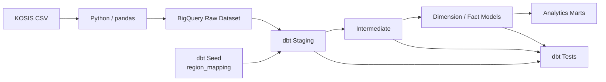

# Tax Revenue Analytics Pipeline

## 1. 프로젝트 개요

* **도메인:** 세무(국세·지방세) 및 행정(인구) 데이터
* **목표:** 국세·지방세 세수 실적과 주민등록인구 데이터를 통합·표준화하여 연도·지역·세목별 세수 구조 변화와 인구 1인당 세수 지표를 분석할 수 있는 Analytics Warehouse 및 재현 가능한 dbt 기반 데이터 파이프라인 구축
* **분석 기간:** 2020-2024
* **개발 기간:** 2026년 9월 1일 ~ 진행 중

본 프로젝트는 서로 다른 구조와 명명 체계를 가진 국세·지방세·인구 데이터를 하나의 분석 체계로 통합하는 과정을 통해 BigQuery와 dbt 기반 Analytics Engineering 역량을 구현하는 것을 목표로 합니다.


## 2. 분석 문제 정의

### 분석 주제

**2020-2024 국세·지방세 세수 구조 변화 및 인구 보정 지역 비교**

재정분권이라는 정책적 맥락을 참고하되, 본 프로젝트는 정책의 인과효과를 추정하기보다 공개 통계에서 관찰되는 국세·지방세 구조 변화와 지역 간 차이를 기술적으로 분석합니다.

### 핵심 분석 질문

* **Q1. 국가 단위 세수 구조 변화**
  * 국세와 지방세 합계에서 지방세가 차지하는 비중은 2020-2024년 동안 어떻게 변화했는가?

* **Q2. 지역별 세수 집중도 변화**
  * 지역별 세수 규모와 전체 세수에서 차지하는 비중은 어떻게 변화했는가?
  * 세수 증가분이 특정 지역에 집중되는 현상이 관찰되는가?

* **Q3. 인구 보정 지역 비교**
  * 지역별 인구 1인당 세수액은 어떻게 변화했는가?
  * 수도권과 비수도권의 인구 1인당 세수액 증가율에는 어떤 차이가 나타나는가?


## 3. 원본 데이터 및 전처리 기준

모든 데이터는 **KOSIS 국가통계포털에서 취득**하였으며, 원본 CSV 파일은 별도로 보존합니다.


### 3.1. 활용 데이터

#### 1. `national_tax_raw.csv`

* **KOSIS 통계표:** 2.1.3 지역별·세목별 세수 현황 [2005-]
* **기간:** 2020-2024
* **지역:** 전국 시·도 기준
* **세목:** 13개 주요 국세 세목
  * 소득세
  * 법인세
  * 상속세
  * 증여세
  * 종합부동산세
  * 부가가치세
  * 개별소비세
  * 주세
  * 인지세
  * 증권거래세
  * 교육세
  * 교통·에너지·환경세
  * 농어촌특별세


#### 2. `local_tax_metro_raw.csv`

#### 3. `local_tax_provincial_raw.csv`

* **KOSIS 통계표**
  * 1-1. 특별시 및 광역시 징수실적(총괄)
  * 1-2. 도별 징수실적(총괄)
* **기간:** 2020-2024
* **지역:** 전국 17개 시·도
* **주요 세목:** 11개 지방세 세목
  * 취득세
  * 등록면허세
  * 레저세
  * 담배소비세
  * 지방소비세
  * 주민세
  * 지방소득세
  * 재산세
  * 자동차세
  * 지역자원시설세
  * 지방교육세
* `과년도수입` 등 일반 세목과 성격이 다른 원천 분류값은 staging 단계에서 보존하고 downstream 분석 목적에 따라 별도로 처리


#### 4. `population_raw.csv`

* **KOSIS 통계표:** 행정구역(읍면동)별/5세별 주민등록인구(2011년-)
* **기간:** 2020-2024
* **지역:** 전국 17개 시·도
* **성별:** 남 / 여
* **연령:** 5세 단위 연령 구간


### 3.2. Python 전처리

원본 CSV의 의미를 변경하지 않는 범위에서 BigQuery 적재가 가능한 형태로 구조를 정리합니다.

주요 처리:

* 다중 헤더 제거
* wide → long 형태 변환
* 컬럼 구조 정규화
* BigQuery 적재에 적합한 형태로 변환
* 원본 파일은 `raw_data/`에 별도 보존


### 3.3. dbt Staging

각 source 특유의 구조와 표현을 일관된 형태로 정규화합니다.

주요 처리:

* 컬럼명 표준화
* 데이터 타입 변환
* 금액 단위 통일
* source별 집계행 및 분석 불가능한 더미행 처리
* 동일 entity의 지역명 표준화
* 기본 데이터 품질 테스트
* source의 유효한 row grain 보존

지역명 표준화에는 `region_mapping` seed를 사용합니다.

예:

```text
서울특별시 → 서울
경기도 → 경기
충청남도 → 충남
```

동일한 지역의 명칭을 표준화하는 작업은 staging에서 수행하되, 서로 다른 지역을 하나의 분석 단위로 병합하는 작업은 intermediate layer에서 수행합니다.


### 3.4. 분석 범위 및 데이터 정합성 원칙

* 2025년은 지방세 통계가 분석에 필요한 동일 범위로 확보되지 않아 분석 대상에서 제외
* 분석 기간 중 제도 변경 등으로 연속적인 비교가 어려운 세목은 원본 및 staging에서 보존한 뒤 분석 단계에서 포함 여부 결정
* 국세와 지방세의 원천 통계 명칭 및 집계 기준 차이는 별도로 관리하고, downstream 모델에서는 공통 measure인 `tax_amount`로 표준화
* 국세 원천 데이터의 지역 집계 기준과 정합성을 맞추기 위해 필요한 지역 병합은 intermediate layer에서 명시적으로 수행
* 원본 데이터를 불필요하게 삭제하기보다 upstream에서 최대한 보존하고, 분석 목적에 따른 제외 로직은 downstream에서 적용


## 4. 데이터 아키텍처



### 데이터 흐름

`KOSIS CSV`
→ `Python 구조 전처리`
→ `BigQuery Raw`
→ `dbt source`
→ `staging`
→ `intermediate`
→ `dimension / fact`
→ `mart`
→ `analysis`


### BigQuery Dataset 구성

```text
tax_admin_raw
└── source에서 참조하는 원천 테이블

tax_admin_staging
└── dbt staging model

tax_admin_seeds
└── dbt seed reference table
```

Intermediate, dimension / fact 및 mart dataset은 해당 layer 구현 과정에서 추가합니다.


## 5. 핵심 데이터 모델링

### 5.1. Staging Models

#### `stg_tax_admin__national_tax`

국세 원천 데이터의 컬럼명, 데이터 타입, 지역 및 세목 구조를 표준화합니다.

**Grain**

`연도 × 지역 × 세목 hierarchy`

주요 처리:

* 연도 및 세수액 타입 변환
* 세수액 원 단위 표준화
* 지방청 및 지역 구조 정리
* 원천 세목 hierarchy 보존
* 유효 세목명 식별
* surrogate key 생성


#### `stg_tax_admin__local_tax_metro`

#### `stg_tax_admin__local_tax_provincial`

특별·광역시와 도 단위로 분리된 지방세 원천 데이터를 동일한 구조로 표준화합니다.

**Grain**

`연도 × 지역 × 세목 hierarchy`

주요 처리:

* 컬럼명 및 데이터 타입 통일
* 세목 hierarchy 정리
* 지역명 표준화
* 금액 타입 및 단위 표준화
* surrogate key 생성


#### `stg_tax_admin__population`

주민등록인구 데이터를 분석 가능한 표준 구조로 변환합니다.

**Grain**

`연도 × 지역 × 성별 × 연령구간`

주요 처리:

* 지역명 표준화
* 성별 값 정규화
* 연령구간 문자열 정리
* 인구수 타입 변환
* surrogate key 생성


### 5.2. Seed

#### `region_mapping`

서로 다른 source에서 사용되는 시·도 명칭을 하나의 표준 지역명으로 변환하기 위한 reference mapping table입니다.

```text
raw_region       standard_region
서울특별시        서울
경기도            경기
충청남도          충남
...
```

여러 staging model에서 동일한 mapping logic을 재사용하여 중복된 `CASE WHEN` 로직을 방지합니다.

Seed 자체에도 데이터 품질 테스트를 적용하여 mapping key의 중복 및 NULL을 검증합니다.


### 5.3. Intermediate Models

**계획**

* 국세·지방세 지역 단위 정합성 확보
* 분석에 필요한 지역 집계 단위 생성
* 국세·지방세 세목 체계 표준화
* 지방세 metro / provincial 데이터 통합
* 인구 데이터의 분석용 aggregation
* 연령구간 등에서 필요한 분석용 파생 컬럼 생성


### 5.4. Dimension / Fact Models

**계획**

* `dim_region`
* `dim_tax`
* `fct_national_tax`
* `fct_local_tax`
* `fct_population`


### 5.5. Analytics Marts

**계획**

* 연도별 국세·지방세 구성비
* 지역별 세수 규모 및 구성 변화
* 지역별 세수 증가율
* 지역별 인구 1인당 세수액
* 수도권·비수도권 비교 지표


## 6. 데이터 품질 관리

dbt test를 통해 각 모델의 grain과 핵심 데이터 품질 규칙을 검증합니다.

주요 검증 항목:

* surrogate key `unique`, `not_null`
* 필수 컬럼 `not_null`
* 범주형 컬럼 `accepted_values`
* dimension / fact 간 `relationships`
* seed mapping key의 `unique`, `not_null`
* source와 downstream 모델 간 row count 검증
* source와 downstream 모델 간 aggregate reconciliation

테스트는 모든 컬럼에 기계적으로 적용하지 않고, NULL 또는 중복이 발생했을 때 실제 데이터 품질 문제로 판단할 수 있는 컬럼을 중심으로 적용합니다.


## 7. 개발 및 커밋 컨벤션

본 프로젝트는 데이터 파이프라인의 재현성과 유지보수성을 높이고 명확한 변경 이력을 관리하기 위해 아래 규칙을 사용합니다.


### 7.1. 핵심 기술 명칭

* **BigQuery**: `빅쿼리`, `bigquery` 등 혼용하지 않음
* **dbt**: `DBT`, `Dbt` 등 혼용하지 않음
* **source**: dbt에서 warehouse의 원천 테이블을 선언하는 리소스
* **dataset**: BigQuery에서 table·view 등을 묶어 관리하는 논리적 컨테이너
* **schema**: dbt에서 데이터 배치 위치를 지정하는 개념으로, BigQuery adapter에서는 dataset에 대응
* **seed**: 작은 정적 reference / mapping 데이터를 CSV로 관리하고 warehouse table로 적재하는 dbt 리소스
* **raw data**: 원본 CSV 파일 및 원천 데이터
* **model**: SQL transformation을 통해 생성되는 dbt 데이터 모델
* **materialization**: dbt model이 warehouse에 view, table 등의 형태로 생성되는 방식
* **test**: 데이터 정합성 및 품질을 검증하는 로직
* **macro**: Jinja를 기반으로 반복 SQL 로직을 재사용하기 위한 dbt 기능


### 7.2. Git Commit Prefix

* `feat`: 새로운 dbt model, seed 및 transformation logic 추가
* `fix`: 버그 수정, 데이터 정합성 문제 및 query 오류 해결
* `refactor`: 비즈니스 로직 변경 없는 구조 개선 및 query 최적화
* `test`: 데이터 품질 검증 로직 추가 및 수정
* `style`: SQL formatting, 들여쓰기 및 공백 등 로직 변경 없는 수정
* `chore`: 프로젝트 설정 및 개발환경 관련 변경
* `docs`: README 및 문서·명세서 작성
* `ci`: CI/CD pipeline 및 배포 설정 변경


## 8. 트러블슈팅

### Google Cloud IAM 보안 정책 차단

* Google Cloud IAM 정책으로 인한 BigQuery 접근 문제 해결
* 로컬 dbt Core와 BigQuery 연결 완료


### Git Rebase 중 Merge Commit Flattening

* rebase 과정에서 merge commit 구조가 평탄화되며 발생한 conflict 분석
* `--rebase-merges`를 사용하여 branch 구조 보존
* `--force-with-lease`를 사용하여 remote repository 안전 동기화
* GitHub Issue #2에 문제 발생 과정과 해결 방법 기록


## 9. 분석상의 한계

* 본 프로젝트는 관찰 데이터 기반 분석으로 정책 변화와 세수 변화 사이의 인과관계를 추정하지 않음
* `인구 1인당 세수액`은 지역 세수액을 주민등록인구로 나눈 분석 지표이며 개별 주민이 실제 부담한 세액을 의미하지 않음
* 물가 조정을 수행하지 않으므로 `실질 세부담액`으로 해석하지 않음
* 국세와 지방세는 원천 통계의 집계 기준 및 세목 체계가 서로 다르므로 모델링 과정에서 해당 차이를 명시적으로 관리
* 특정 지역에 귀속된 세수는 해당 지역 주민만의 경제활동 또는 조세 부담으로 직접 해석하지 않음
* 지역 단위 비교에서는 원천 통계의 지역 집계 기준 차이를 고려함


## 10. 기술 스택

* **Language:** SQL, Python
* **Transformation:** dbt Core
* **Data Warehouse:** Google BigQuery
* **Data Processing:** pandas
* **Version Control:** Git, GitHub
* **Development Environment:** Cursor