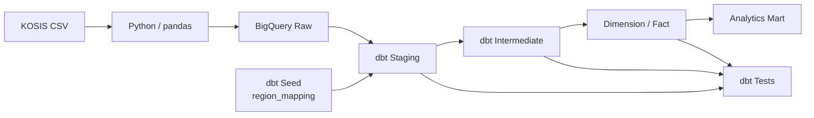

# Tax Revenue Analytics Pipeline

BigQuery와 dbt를 활용하여 국세·지방세·주민등록인구 데이터를 통합하고,
연도·지역·세목별 세수 구조와 인구 보정 지표를 분석하기 위한 Analytics Engineering 프로젝트입니다.

---

## 1. 프로젝트 개요

* **도메인:** 세무(국세·지방세) 및 행정(인구) 데이터
* **목표:** 서로 다른 구조의 국세·지방세·인구 데이터를 통합·표준화하여 분석 가능한 Analytics Warehouse 및 재현 가능한 dbt 기반 데이터 파이프라인 구축
* **분석 기간:** 2020-2024
* **개발 기간:** 2026년 9월 1일 ~ 진행 중

본 프로젝트는 단순한 통계 분석보다,
서로 다른 원천 데이터의 grain·지역 체계·세목 체계를 분석 목적에 맞게 정합화하는
Analytics Engineering 과정에 중점을 둡니다.

---

## 2. 분석 문제 정의

### 분석 주제

**2020-2024 국세·지방세 세수 구조 변화 및 인구 보정 지역 비교**

재정분권이라는 정책적 맥락을 참고하되,
정책의 인과효과를 추정하기보다 공개 통계에서 관찰되는
국세·지방세 구조 변화와 지역 간 차이를 기술적으로 분석합니다.

### 핵심 분석 질문

* **Q1. 국가 단위 세수 구조 변화**
  * 국세와 지방세 합계에서 지방세가 차지하는 비중은 2020-2024년 동안 어떻게 변화했는가?

* **Q2. 지역별 세수 집중도 변화**
  * 지역별 세수 규모와 전체 세수에서 차지하는 비중은 어떻게 변화했는가?
  * 세수 증가분이 특정 지역에 집중되는 현상이 관찰되는가?

* **Q3. 인구 보정 지역 비교**
  * 지역별 인구 1인당 세수액은 어떻게 변화했는가?
  * 수도권과 비수도권의 인구 1인당 세수액 증가율에는 어떤 차이가 나타나는가?

---

## 3. 기술 스택

| 영역 | 기술 |
|---|---|
| Language | SQL, Python |
| Data Warehouse | Google BigQuery |
| Transformation | dbt Core |
| Data Processing | pandas |
| Data Quality | dbt tests, dbt-utils |
| Version Control | Git, GitHub |
| Development Environment | Cursor |

---

## 4. 원본 데이터 및 전처리 기준

모든 분석 데이터는 **KOSIS 국가통계포털에서 취득**하였으며,
원본 CSV의 의미를 변경하지 않는 범위에서 분석 파이프라인을 구성합니다.

원천 데이터는 upstream에서 최대한 보존하고,
분석 목적에 따른 지역 병합·세목 제외·aggregation은 downstream에서 명시적으로 수행합니다.

### 4.1. 활용 데이터

#### 1. `national_tax_raw.csv`

* **KOSIS 통계표:** 2.1.3 지역별·세목별 세수 현황 [2005-]
* **기간:** 2020-2024
* **지역:** 전국 17개 시·도
* **세목:** 「국세기본법」 제2조제1호에 따른 13개 국세 세목
  * 소득세
  * 법인세
  * 상속세
  * 증여세
  * 종합부동산세
  * 부가가치세
  * 개별소비세
    * 원천 데이터에서는 `개별(특별)소비세`로 표기
  * 주세
  * 인지세
  * 증권거래세
  * 교육세
  * 교통·에너지·환경세
  * 농어촌특별세

* **유의사항**
  * 국세 세수실적은 총수납액에서 환급액을 차감한 순수납액 기준으로 집계된다.
  * 일부 연도·지역·세목에서는 환급 등의 영향으로 세수실적이 음수로 나타날 수 있다.
  * 원천 데이터까지 역추적하여 유효한 값임을 확인한 음수 세수액은 임의로 제거하거나 0으로 치환하지 않고 유지한다.

#### 2. `local_tax_metro_raw.csv` / `local_tax_provincial_raw.csv`

* **KOSIS 통계표**
  * 1-1. 특별시 및 광역시 징수실적(총괄)
  * 1-2. 도별 징수실적(총괄)
* **기간:** 2020-2024
* **지역:** 전국 17개 시·도
* **세목:** 「지방세기본법」 제7조에 따른 11개 지방세 세목
  * 취득세
  * 등록면허세
  * 레저세
  * 담배소비세
  * 지방소비세
  * 주민세
  * 지방소득세
  * 재산세
  * 자동차세
  * 지역자원시설세
  * 지방교육세

* **유의사항**
  * 일부 지역·연도의 레저세 세수액은 원천 통계에서 실제 0으로 집계되며, 유효한 값으로 유지한다.

#### 3. `population_raw.csv`

* **KOSIS 통계표:** 행정구역(읍면동)별/5세별 주민등록인구(2011년-)
* **기간:** 2020-2024
* **지역:** 전국 17개 시·도
* **성별:** 남 / 여
* **연령:** 5세 단위 연령 구간

### 4.2. Python 전처리

`scripts/preprocess.py`를 통해 원본 CSV의 의미를 변경하지 않는 범위에서
BigQuery 적재가 가능한 구조로 변환합니다.

주요 처리:

* 다중 헤더 제거
* wide → long 변환
* 불필요한 합계·소계 구조 정리
* 컬럼 구조 정규화
* BigQuery 적재에 적합한 형태로 변환

Python 단계에서는 분석 목적에 따른 비즈니스 로직을 최소화하고,
의미 기반 transformation은 가능한 한 dbt 모델에서 명시적으로 수행합니다.

### 4.3. 데이터 정합성 원칙

* 2025년은 지방세 통계가 동일한 분석 범위로 확보되지 않아 분석 대상에서 제외
* 원본 데이터와 staging에서는 가능한 한 source의 유효한 정보를 보존
* 동일 entity의 명칭 표준화는 staging에서 수행
* 서로 다른 지역을 하나의 분석 단위로 병합하는 작업은 intermediate에서 수행
* 분석 범위에서 제외되는 세목은 staging에서 삭제하지 않고 intermediate에서 명시적으로 필터링
* 국세와 지방세의 서로 다른 원천 컬럼은 downstream에서 공통 measure인 `tax_amount`로 표준화
* 0 또는 음수라는 이유만으로 유효한 원천값을 이상치로 제거하지 않음

---

## 5. 데이터 아키텍처


```mermaid
flowchart LR
    A[KOSIS CSV] --> B[Python / pandas]
    B --> C[BigQuery Raw]

    S[dbt Seed<br/>region_mapping] --> D[dbt Staging]
    C --> D

    D --> E[dbt Intermediate]
    E --> F[Dimension / Fact]
    F --> G[Analytics Mart]

    D --> T[dbt Tests]
    E --> T
    F --> T
```

### 데이터 흐름

```text
KOSIS CSV
    ↓
Python 구조 전처리
    ↓
BigQuery Raw
    ↓
dbt source
    ↓
Staging
    ↓
Intermediate
    ↓
Dimension / Fact
    ↓
Analytics Mart
    ↓
Analysis
```

### BigQuery Dataset 구성

```text
tax_admin_raw
└── source가 참조하는 원천 테이블

tax_admin_staging
└── dbt staging models

tax_admin_intermediate
└── dbt intermediate models

tax_admin_seeds
└── dbt seed reference tables

tax_admin_marts
└── dimension / fact / analytics mart models
```

---

## 6. 데이터 모델링

### 6.1. Staging Models

Staging에서는 source 특유의 구조를 정규화하되
원천 데이터의 유효한 grain과 계층 정보를 최대한 보존합니다.

#### `stg_tax_admin__national_tax`

국세 원천 데이터의 컬럼명, 데이터 타입, 지역 및 세목 계층 구조를 표준화합니다.

**Grain**

```text
tax_year
× regional_tax_office
× region
× tax_category_level_1
× tax_category_level_2
× tax_category_level_3
× tax_category_level_4
× tax_category_level_5
× tax_category_level_6
```

동일 지역이 복수 지방국세청에 걸쳐 집계될 수 있으므로
`regional_tax_office`를 grain에 포함합니다.

예를 들어 경기 지역은 원천 데이터에서 중부청과 인천청에 각각 존재하므로
`tax_year × region × tax_name`만으로는 staging 행을 유일하게 식별할 수 없습니다.

주요 처리:

* 컬럼명 및 타입 표준화
* 세수액 원 단위 변환
* 지방청·지역 구조 정리
* 원천 세목 hierarchy 보존
* 계층 1-6단계 중 구조적 `소계` 값을 제외한 실질 세목명을 `effective_tax_category_name`으로 추출

#### `stg_tax_admin__local_tax_metro`
#### `stg_tax_admin__local_tax_provincial`

특별·광역시와 도 단위로 분리된 지방세 원천 데이터를 동일한 컬럼 구조로 표준화합니다.

**Grain**

```text
tax_year
× region
× tax_category_level_1
× tax_category_level_2
```

동일한 세목명이 서로 다른 상위 분류 아래 반복될 수 있기 때문에
`tax_category_level_1`과 `tax_category_level_2`를 함께 grain에 포함합니다.

주요 처리:

* 컬럼명 및 타입 표준화
* 세목 hierarchy 보존
* 지역명 표준화
* 세수액 원 단위 변환

#### `stg_tax_admin__population`

주민등록인구 데이터를 표준 분석 구조로 변환합니다.

**Grain**

```text
population_year
× region
× gender
× age
```

주요 처리:

* 지역명 표준화
* 성별 값 정규화
* 연령구간 정규화
* 인구수 타입 변환

---

### 6.2. Seed

#### `region_mapping`

서로 다른 source의 시·도 명칭을 하나의 표준 지역명으로 변환하기 위한 reference table입니다.

```text
raw_region       standard_region
서울특별시        서울
경기도            경기
충청남도          충남
...
```

여러 staging 모델에서 동일한 mapping logic을 재사용하여
중복된 `CASE WHEN` 로직을 방지합니다.

Mapping key에는 `unique`, `not_null` 등 데이터 품질 테스트를 적용합니다.

---

### 6.3. Intermediate Models

Intermediate에서는 staging에서 보존한 source 구조를
실제 분석에 사용할 공통 grain으로 변환합니다.

#### `int_tax_admin__national_tax`

**Grain**

```text
tax_year × region × tax_name
```

**최종 컬럼**

```text
tax_year
region
tax_name
tax_amount
```

주요 처리:

* `effective_tax_category_name` 기준으로 분석 대상 13개 국세 세목만 유지
* 상위 집계항목·중간 계층·하위 세목 등 분석 grain과 다른 계층의 행 제외
* 2019년 인천지방국세청 신설 이후에도 원천 데이터에 형식상 잔존하는 `중부청-인천` 행 제거
* 인천청과 중부청에 나뉘어 존재하는 경기 지역 세수를 하나의 경기 지역으로 집계
* 세목 계층 및 지방청 컬럼 제거
* `effective_tax_category_name`을 `tax_name`으로 표준화

이를 통해 복수의 세목 계층 및 지방청 구조를 가진 국세 데이터를
`연도 × 지역 × 세목` 단위의 분석용 모델로 변환합니다.

#### `int_tax_admin__local_tax`

**Grain**

```text
tax_year × region × tax_name
```

**최종 컬럼**

```text
tax_year
region
tax_name
tax_amount
```

주요 처리:

* 특별·광역시(`metro`)와 도(`provincial`) 데이터를 `UNION ALL`로 통합
* `tax_category_level_2`를 분석용 `tax_name`으로 표준화
* 현행 지방세 세목이 아닌 `도축세`, `도시계획세`, `과년도수입` 제외
* 충남과 세종을 `충남·세종`으로 통합
* 동일 `tax_year × region × tax_name`의 지방세액 합산
* 최종 분석 대상 11개 지방세 세목으로 정리

#### `int_tax_admin__population`

**Grain**

```text
population_year × region
```

**최종 컬럼**

```text
population_year
region
population_count
```

주요 처리:

* 충남과 세종을 `충남·세종`으로 통합
* 성별·연령구간을 제거하고 지역별 총인구로 aggregation
* `population_year × region` 단위의 분석용 인구 모델 생성

---

### 6.4. Dimension / Fact Models

**구현 예정**

* `dim_region`
* `dim_tax`
* `fct_national_tax`
* `fct_local_tax`
* `fct_population`

Intermediate에서 정합화한 공통 지역·세목 체계를 기반으로
분석용 dimension / fact 모델을 구성할 예정입니다.

### 6.5. Analytics Marts

**구현 예정**

* 연도별 국세·지방세 구성비
* 지역별 세수 규모 및 구성 변화
* 지역별 세수 증가율
* 지역별 인구 1인당 세수액
* 수도권·비수도권 비교 지표

---

## 7. 데이터 품질 관리

각 레이어에서 발생할 수 있는 데이터 품질 위험에 맞춰 dbt test를 적용합니다.

### 자동화된 dbt test

주요 검증 항목:

* 핵심 measure의 `not_null`
* 새롭게 정의되는 범주형 컬럼의 `accepted_values`
* `dbt_utils.unique_combination_of_columns`를 통한 grain 유일성 검증
* seed mapping key의 `unique`, `not_null`
* 향후 dimension / fact 모델 간 `relationships`

Upstream에서 이미 검증되었고 downstream에서 값이 변경되지 않는 컬럼에는
동일 테스트를 기계적으로 반복하기보다,
각 transformation에서 새롭게 발생하는 위험과 output contract를 중심으로 테스트합니다.

### Staging grain 검증

* 국세  
  `tax_year × regional_tax_office × region × tax_category_level_1~6`

* 지방세  
  `tax_year × region × tax_category_level_1 × tax_category_level_2`

* 인구  
  `population_year × region × gender × age`

Staging에서는 surrogate key를 별도로 생성하지 않고
실제 business grain을 구성하는 컬럼 조합의 유일성을 직접 검증합니다.

### Intermediate grain 검증

* 국세  
  `tax_year × region × tax_name`

* 지방세  
  `tax_year × region × tax_name`

* 인구  
  `population_year × region`

각 Intermediate 모델에서 aggregation 이후 새롭게 정의된 grain에
`unique_combination_of_columns` 테스트를 적용합니다.

### 개발 단계 정합성 검증

dbt test와 별도로 transformation 구현 과정에서 다음 검증을 수행합니다.

* source / staging / intermediate 간 row count 확인
* distinct region 및 tax_name 확인
* aggregation 전후 세수 합계 reconciliation
* 원천까지 역추적하여 음수·0 세수값의 유효성 확인

예를 들어 국세 경기 데이터는 동일한 13개 분석 세목을 기준으로
staging의 중부청·인천청 세수 합계와 intermediate의 경기 세수 합계가
일치하는지 확인하여 aggregation 과정에서 금액 손실 또는 중복이 없는지 검증합니다.

---

## 8. 재현 방법

### 1. Python 전처리

원본 KOSIS CSV를 준비한 뒤:

```bash
python scripts/preprocess.py
```

를 통해 BigQuery 적재용 구조로 변환합니다.

### 2. BigQuery Raw 적재

전처리된 데이터를 BigQuery의 raw dataset에 적재한 뒤
dbt source를 통해 참조합니다.

### 3. dbt dependency 설치

```bash
dbt deps
```

### 4. Seed 적재

```bash
dbt seed
```

### 5. 모델 실행 및 테스트

```bash
dbt build
```

개별 모델 개발 시에는 dbt selection syntax를 사용하여
필요한 모델과 dependency 범위만 실행할 수 있습니다.

---

## 9. 주요 Engineering Decision

### Source grain 보존과 분석 grain 분리

Staging에서는 원천 데이터의 유효한 계층과 grain을 가능한 한 보존하고,
Intermediate에서 분석 목적에 맞는 grain으로 명시적으로 변환합니다.

이를 통해 원천 정보의 손실을 최소화하면서
downstream 분석 모델의 구조를 단순화합니다.

### 지역 표준화와 지역 병합 분리

```text
서울특별시 → 서울
경기도 → 경기
```

처럼 동일 entity의 명칭만 변경하는 작업은 staging에서 수행합니다.

반면:

```text
충남 + 세종 → 충남·세종
인천청 경기 + 중부청 경기 → 경기
```

처럼 여러 원천 행 또는 지역을 하나의 분석 단위로 통합하는 작업은
Intermediate에서 수행합니다.

### 유효한 0·음수 값 보존

0 또는 음수라는 값의 형태만으로 이상치로 판단하지 않고
원천 통계의 의미와 source 데이터를 확인한 뒤 처리 여부를 결정합니다.

* 국세 일부 지역·세목의 음수 세수 → 유효한 순수납액으로 유지
* 지방세 일부 지역·연도의 레저세 0 → 유효한 원천값으로 유지

---

## 10. 트러블슈팅 및 개발 기록

프로젝트 과정에서 발생한 주요 문제와 해결 과정은 GitHub Issue를 통해 별도로 기록합니다.

대표 사례:

* Git interactive rebase 과정에서 merge history가 평탄화된 문제 분석
* `--rebase-merges` 적용 후 이미 merge된 과거 commit까지 재작성되며 branch ancestry가 끊어진 문제 확인
* 정상 `origin/main`을 기준으로 `git rebase --onto`를 사용하여 feature branch history 복구
* `--force-with-lease`를 사용한 remote branch 안전 갱신
* 상세 과정: GitHub Issue #2

공유되거나 이미 merge된 history는 commit message 정리를 목적으로 재작성하지 않고,
history rewriting은 아직 공유되지 않은 branch 범위에서만 수행하는 원칙을 적용합니다.

---

## 11. 분석상의 한계

* 본 프로젝트는 관찰 데이터 기반 분석으로 정책 변화와 세수 변화 사이의 인과관계를 추정하지 않음
* `인구 1인당 세수액`은 지역 세수액을 주민등록인구로 나눈 분석 지표이며 개별 주민이 실제 부담한 세액을 의미하지 않음
* 물가 조정을 수행하지 않으므로 명목 세수 변화와 실질 세부담 변화를 동일하게 해석하지 않음
* 국세와 지방세는 원천 통계의 집계 기준 및 세목 체계가 서로 다르므로 모델링 과정에서 해당 차이를 명시적으로 관리
* 특정 지역에 귀속된 세수는 해당 지역 주민만의 경제활동 또는 조세 부담으로 직접 해석하지 않음
* 지역 단위 비교에서는 원천 통계의 지역 귀속 및 집계 기준 차이를 고려해야 함